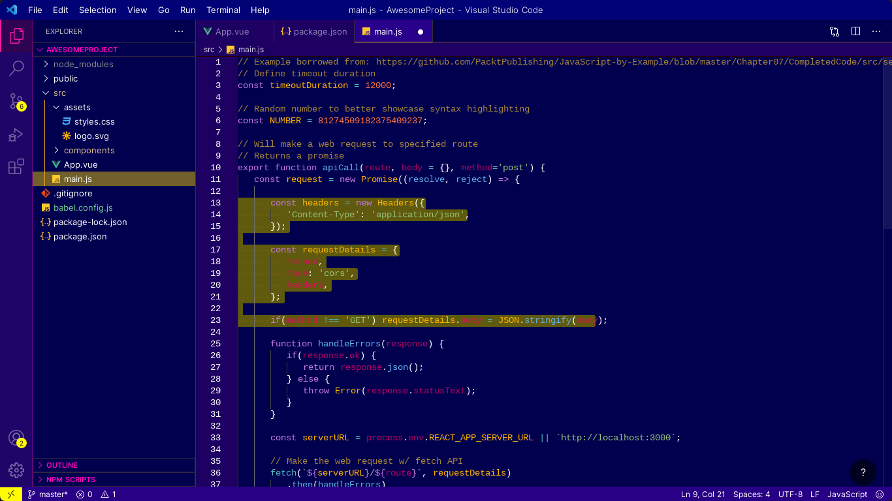
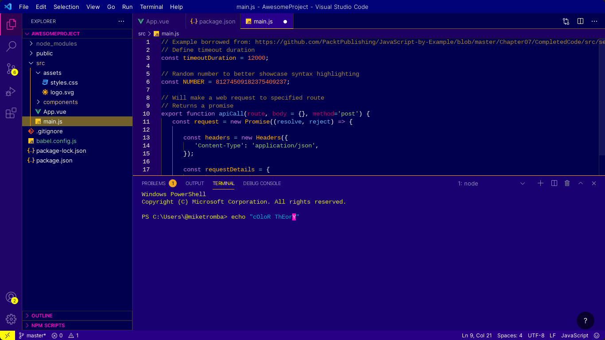
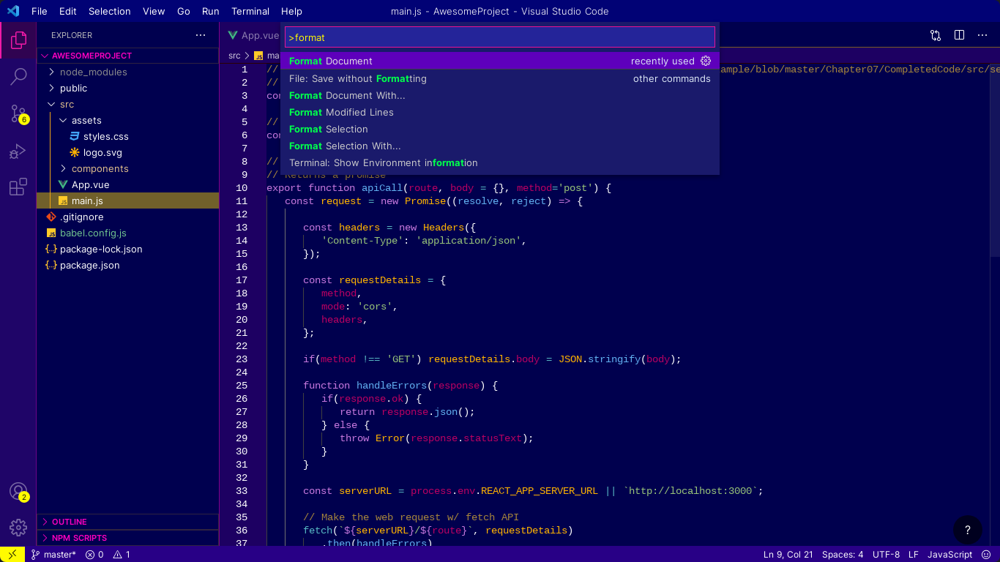

# Night Sky Theme for Visual Studio Code
  
  
  

Designed a stylish and beautiful theme for VS Code.

## Preview




## Tool
[Theme Studio for VS Code](https://themes.vscode.one)

## How to customize the terminal
```json
//settings.json
"workbench.colorCustomizations": {
        "terminal.background":"#1a0172",
        "terminalCursor.foreground": "#ff00c4",
    },
```
> https://memoriae.mattune.jp/2020/03/05/vscode-terminal-color/